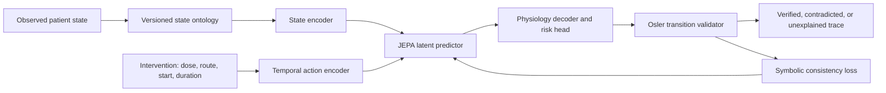

# Osler-JEPA Architecture and Roadmap

## Intended Roles

Osler and JEPA should not compete for the same job.

- **JEPA is the patient world model.** It predicts how a physiological state may
  evolve under an explicit intervention schedule.
- **Osler is the teacher, validator, safety authority, and explanation engine.**
  It checks learned transitions against known mechanisms and patient constraints.
- **The decoder is the shared language.** JEPA must return canonical physiological
  variables and flags that Osler can inspect. A latent vector alone is not a
  clinically useful answer.



The prediction contract is:

```text
canonical state(t) + intervention schedule + elapsed time
    -> canonical state(t + delta) + risk + Osler validation trace
```

## Implemented Foundation

The current DKA implementation now contains:

1. `osler_jepa/ontology.py`: a versioned state vocabulary with aliases shared by
   the live symbolic matcher and numerical DKA model. Related-but-directionally
   different concepts such as hypoxia and SpO2 remain separate states.
2. `osler_jepa/actions.py`: an intervention schema and time-aware action encoder.
3. `osler_jepa/validator.py`: differentiable mechanism constraints plus readable
   transition audits.
4. `osler_jepa/curriculum.py`: staged learning from state grounding to disease
   dynamics, treatment effects, and counterfactual validation.
5. `train_intervention_jepa.py`: paired patient branches, open-loop rollouts,
   counterfactual effect learning, anti-collapse loss, risk prediction, and Osler
   consistency loss.
6. `predict_dka_intervention.py`: dynamic 30-minute safety re-evaluation instead
   of applying one unchanged action for the entire horizon, followed by an Osler
   `verified`, `contradicted`, or `unexplained` transition trace.
7. `dka_body.py`: patient-level domain randomization for body size, renal reserve,
   insulin response, stress physiology, fluid response, vascular tone, potassium
   stores, endogenous insulin, baseline sodium, and baseline creatinine. Training
   branches start across different points in the simulated treatment course.
8. `mimic_action_history.py`: a shared dose/unit normalizer that combines ICU
   `inputevents` with hospital `emar`/`emar_detail`, separates dextrose grams from
   carrier-fluid volume, and builds future and prior-treatment action grids.

The current June 2026 v4 checkpoint was trained on 1,000 simulated patient
profiles, each cloned into 11 intervention branches for 55 epochs. It predicts 15
states from eight route-aware actions and a six-hour treatment history.
On held-out simulated patients:

- Six-hour glucose MAE: `36.56 mg/dL`
- Six-hour potassium MAE: `0.187 mmol/L`
- Six-hour effective-osmolality MAE: `2.78 mOsm/kg`
- Six-hour latent K-store MAE: `3.41`
- Six-hour hyperosmolar-injury MAE: `0.484`
- Counterfactual effect-sign accuracy: `96.22%`
- Action-shuffled normalized MSE: `0.552` versus factual `0.046`
- Death-risk Brier score: `0.0324`; recall `86.9%`; specificity `95.5%`
- Nine direct mechanism signs: `9/9`
- Effective latent rank: `12.484`; all 48 latent dimensions active; not collapsed

These numbers validate learning against the DKA simulator. They are not evidence
of clinical treatment accuracy.

## Safe Self-Learning Loop

Self-learning should update the numerical world model without silently changing
Osler's hard safety policy.

1. Store a transition with patient history, missingness, intervention dose/route/
   timing, future observations, and provenance.
2. Convert observations to the versioned canonical ontology.
3. Train JEPA to predict future state and treatment effect, not merely reconstruct
   the current patient.
4. Ask Osler to label each learned effect as `verified`, `contradicted`, or
   `unexplained`.
5. Backpropagate verified mechanism constraints and quarantine contradictions for
   review.
6. Turn repeated unexplained effects into **rule candidates**, never automatic hard
   rules. Each candidate requires provenance, held-out validation, and approval.
7. Promote a checkpoint only after all collapse, intervention-sensitivity,
   generalization, and safety gates pass.

## Promotion Gates

A disease model is not ready for integration unless it:

- Beats persistence and simple clinical baselines on held-out patients.
- Has positive changed-only delta correlation and effect direction above chance.
- Produces similar outcomes for similar states under the same action.
- Produces detectably different outcomes under materially different actions.
- Passes latent variance and effective-rank collapse checks.
- Passes Osler mechanism rules with no unresolved high-severity contradictions.
- Generalizes across patient, time, and hospital splits.
- Reports calibration and uncertainty, including out-of-distribution warnings.

## Current Limitation

The MIMIC-IV demo was rebuilt with dose/time grids and pre-anchor history: 187
transitions from 12 DKA stays, with 103 complete core-input windows and 42 active-
DKA comparison windows. The current JEPA beats persistence only for MAP. Active-
DKA glucose MAE improves from v3 `204.55` to v4 `138.46 mg/dL` but persistence is
still better at `96.65`. V4 beats persistence for active-DKA anion gap and MAP.
Route-aware DKABody replay improves glucose MAE from `235.32` to `195.45`, but
still produces 12/12 simulated deaths. The structural gap is smaller, not closed.

## Next Build Order

### Phase 1: Complete the DKA Contract

- Add observation masks and calibrated uncertainty to the 15-state contract.
- Replace grid-implied action continuity with explicit start/stop event encoding.
- Replace the anchor-only K-store prior with a learned predict-update belief filter.
- Calibrate potassium depletion and cumulative hyperosmolar injury on a larger
  patient-held-out cohort.
- Obtain a larger MIMIC cohort; the 12-stay demo cannot identify causal treatment
  effects or support JEPA fine-tuning.

### Phase 2: Add Disease Modules One at a Time

Build separate state adapters, simulators/data loaders, and validator rule packs
for sepsis, asthma, and acute kidney injury. Keep the shared ontology and action
schema; do not mix diseases into one unvalidated latent space at the start.

### Phase 3: Learn From Real EHR Trajectories

- Preserve actual dose, route, formulation, start, stop, and administration timing.
- Model missingness and irregular observation intervals explicitly.
- Correct treatment-selection bias with propensity or doubly robust estimation.
- Evaluate against matched controls and patient/hospital-held-out baselines.
- Keep simulator and EHR provenance separate in training and reports.

### Phase 4: Connect to the Live Symbolic Engine

The live drug ranker may call a promoted JEPA only to simulate and compare candidate
actions already allowed by Osler. JEPA cannot introduce a drug, bypass a safety
veto, or supply an unvalidated dose. Osler remains the final explanation and veto
layer.
